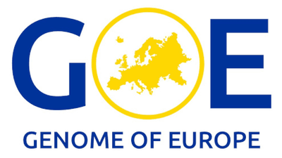

  <h1 class="title raports-section-title">Participating projects</h1>

  

    

      

        

          

            <button class="btn btn-link ongoing-collapse-btn collapsed" type="button" data-toggle="collapse" data-target="#collapseGDI" data-parent="#ongoing-accordion" aria-expanded="false" aria-controls="collapseGDI">
              
              GDI
            </button>
          

          

            

              <ul class="ongoing-links-list">
                <li><a href="https://gdi.onemilliongenomes.eu/news/gdi-technical-infrastructure">Demonstration of 1+MG technical infrastructure (spring 2025)</a></li>
                <li><a href="https://www.youtube.com/watch?v=YDCvy6ixUdw&t=46s">GDI Technical Demonstrator: Distributed analysis and federated learning</a></li>
                <li><a href="https://www.youtube.com/watch?v=uCjlFXSvFAs">1+ Million Genomes infrastructure - the benefits of federated analysis</a></li>
              </ul>
            

          

        

        

          

            <button class="btn btn-link ongoing-collapse-btn collapsed" type="button" data-toggle="collapse" data-target="#collapseEUCAIM" data-parent="#ongoing-accordion" aria-expanded="false" aria-controls="collapseEUCAIM">
              
              EUCAIM
            </button>
          

          

            

              <ul class="ongoing-links-list">
                <li><a href="https://cancerimage.eu/achievements/">EUCAIM latest product compilation</a></li>
                <li><a href="https://www.youtube.com/watch?v=bH_NiEWFMAA">EUCAIM webinar on EUCAIM and use cases (March 2024)</a></li>
              </ul>
            

          

        

        

          

            <button class="btn btn-link ongoing-collapse-btn collapsed" type="button" data-toggle="collapse" data-target="#collapseHDS" data-parent="#ongoing-accordion" aria-expanded="false" aria-controls="collapseHDS">
              
              HDS
            </button>
          

          

            

              <strong>Legal Toolbox:</strong>
              <ul class="ongoing-links-list">
                <li><a href="https://legaltoolbox.healthdatasweden.eu/" target="_blank">https://legaltoolbox.healthdatasweden.eu/</a></li>
              </ul>
              <h4 class="card-title" style="font-weight: 900; text-align: left; color: #3F3F3F; font-size: calc(1em + 0.5pt);">
                HDS examples of customer journey services:
              </h4>
              <ul class="ongoing-links-list">
                <li><a href="https://european-digital-innovation-hubs.ec.europa.eu/knowledge-hub/success-stories/guidance-city-improvement-through-demand-acceleration-methodology">https://european-digital-innovation-hubs.ec.europa.eu/knowledge-hub/success-stories/guidance-city-improvement-through-demand-acceleration-methodology</a></li>
                <li><a href="https://european-digital-innovation-hubs.ec.europa.eu/knowledge-hub/success-stories/new-era-blood-sampling-transforming-future-diagnostics">https://european-digital-innovation-hubs.ec.europa.eu/knowledge-hub/success-stories/new-era-blood-sampling-transforming-future-diagnostics</a></li>
                <li><a href="https://european-digital-innovation-hubs.ec.europa.eu/knowledge-hub/success-stories/field-testing-methodology-healthcare">https://european-digital-innovation-hubs.ec.europa.eu/knowledge-hub/success-stories/field-testing-methodology-healthcare</a></li>
              </ul>
              <h4 class="card-title" style="font-weight: 900; text-align: left; color: #3F3F3F; font-size: calc(1em + 0.5pt);">
                HDS report (August 2024):
              </h4>
              <ul class="ongoing-links-list">
                <li><a href="https://lnu.se/mot-linneuniversitetet/aktuellt/nyheter/2024/ny-rapport-hur-hanterar-sveriges-regioner-sin-halsodata/">How do Sweden's regions manage their health data?</a></li>
              </ul>
            

          

        

        

          

            <button class="btn btn-link ongoing-collapse-btn collapsed" type="button" data-toggle="collapse" data-target="#collapseTEF" data-parent="#ongoing-accordion" aria-expanded="false" aria-controls="collapseTEF">
              
              TEF-Health
            </button>
          

          

            

              <ul class="ongoing-links-list">
                <li><a href="https://tefhealth.se/">TEF-Health Sweden</a></li>
              </ul>
            

          

        

        

          

            <button class="btn btn-link ongoing-collapse-btn collapsed" type="button" data-toggle="collapse" data-target="#collapseGoE" data-parent="#ongoing-accordion" aria-expanded="false" aria-controls="collapseGoE">
              
              GENOME OF EUROPE
            </button>
          

          

            

              <ul class="ongoing-links-list">
                <li><a href="https://digital-strategy.ec.europa.eu/en/news/genome-europe-project-launched-first-step-towards-european-reference-genome">Genome of Europe project </a></li>
              </ul>
            

          

        

        

          

            <button class="btn btn-link ongoing-collapse-btn collapsed" type="button" data-toggle="collapse" data-target="#collapseGMS" data-parent="#ongoing-accordion" aria-expanded="false" aria-controls="collapseGMS">
              
              GMS
            </button>
          

          

            

              <ul class="ongoing-links-list">
                <li><a href="https://genomicmedicine.se">Genomic Medicine Sweden</a></li>
                <li><a href="https://genomicmedicine.se/2025/11/19/genomic-medicine-sweden-lanserar-ny-rapport-om-precisionsmedicinens-framsteg/" target="_blank">GMS launches new report on progress in precision medicine (Nov 2025)</a></li>
              </ul>
            

          

        

      

    

  

  
<a href="{{ '/outputs_en/' | relative_url }}" class="outputs-back-to-resultat">&larr; Back to Results</a>

