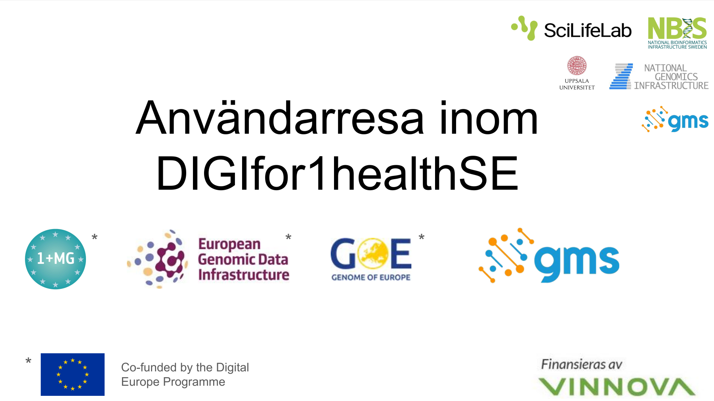
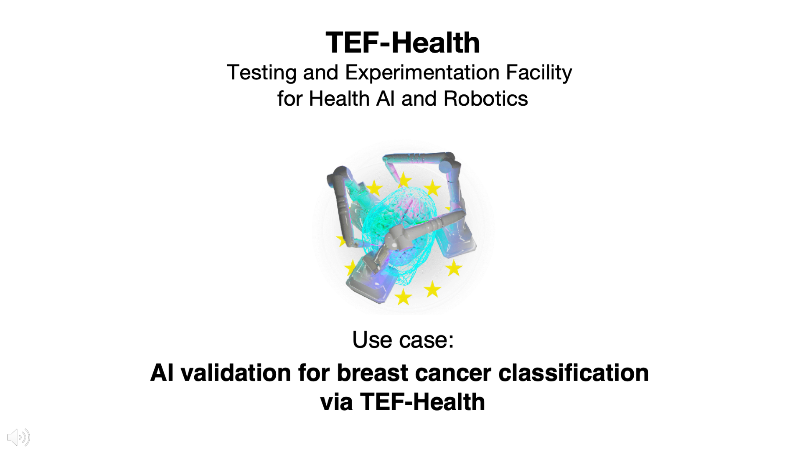
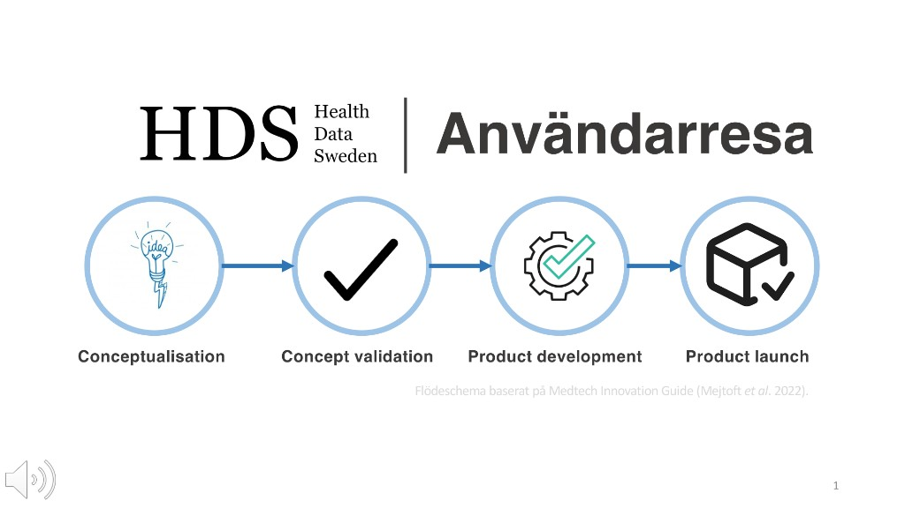

  <h1 class="title raports-section-title">User journeys</h1>

  

    

      

        <button type="button" class="raports-video-trigger" data-video-url="https://play.kth.se/embed/secure/iframe/entryId/0_qo29oj8h/uiConfId/23453971/st/0" aria-label="Play video for user journey 1">
          <i class="fas fa-play"></i>
          
        </button>
        

          <h5 class="card-title" style="font-weight: bold; text-align: center; color: #045C64;">User journey 1: Making genomic data accessible in the future (in Swedish)</h5>
          <a href="https://github.com/ScilifelabDataCentre/DIGIfor1Health_web/raw/master/assets/Anvresa_DIGIfor1healthSE_GDI_GoE_GMS_pdf%20och%20text.pdf" class="btn btn-primary mt-auto raports-download-btn" download target="_blank">Download PDF</a>
        

      

    

    

      

        <button type="button" class="raports-video-trigger" data-video-url="https://play.kth.se/embed/secure/iframe/entryId/0_2lbw85dc/uiConfId/23453971/st/0" aria-label="Play video for user journey 2">
          <i class="fas fa-play"></i>
          
        </button>
        

          <h5 class="card-title" style="font-weight: bold; text-align: center; color: #045C64;">User journey 2: AI testing and validation in healthcare</h5>
          <a href="https://github.com/ScilifelabDataCentre/DIGIfor1Health_web/raw/master/assets/Anvresa_DIGIfor1healthSE_TEF-Health_pdf%20och%20text.pdf" class="btn btn-primary mt-auto raports-download-btn" download target="_blank">Download PDF</a>
        

      

    

    

      

        <button type="button" class="raports-video-trigger" data-video-url="https://play.kth.se/embed/secure/iframe/entryId/0_teicum62/uiConfId/23453971/st/0" aria-label="Play video for user journey 3">
          <i class="fas fa-play"></i>
          
        </button>
        

          <h5 class="card-title" style="font-weight: bold; text-align: center; color: #045C64;">User journey 3: Support for developing health data products and innovation</h5>
          <a href="https://github.com/ScilifelabDataCentre/DIGIfor1Health_web/raw/master/assets/Anvresa_DIGIfor1healthSE_HDS_pdf%20och%20text.pdf" class="btn btn-primary mt-auto raports-download-btn" download target="_blank">Download PDF</a>
        

      

    

  

  <h1 class="title raports-section-title">Reports</h1>
  

    

      

        
        

          <h4 class="card-title" style="font-weight: bold; text-align: center; color: #045C64;">
            Situation analysis April 2025
          </h4>
          

   DIGIfor1healthSE — collaboration for sustainable access to and use of health data: <a href="https://doi.org/10.17044/scilifelab.28882028" target="_blank">https://doi.org/10.17044/scilifelab.28882028</a>    

The analysis highlights that it is vital for Sweden to develop a national digital infrastructure for health data with a holistic view of primary and secondary use ahead of EHDS implementation, in collaboration with relevant stakeholders. To enable privacy-preserving, efficient access to health data, data must be freed from siloed systems in Sweden and fit-for-purpose, harmonised solutions developed—achieving interoperability across semantic, technical, organisational, and legal dimensions while integrating ethical and social aspects.

        

      

    

    

      

        
        

          <h4 class="card-title" style="font-weight: bold; text-align: center; color: #045C64;">
            Pilot study September 2023
          </h4>
          

    For effective and sustainable use of health data through integration of the DIGITAL projects in Sweden: <a href="https://doi.org/10.17044/scilifelab.24199164" target="_blank">https://doi.org/10.17044/scilifelab.24199164</a>   

The report was produced as input for reporting to the funder and to guide planning and delivery of current health data collaborations. It compiles our shared expertise in legal issues, semantic interoperability, technical infrastructure, and data security. It also includes risk analyses and discussion on designing solutions for data sharing and proposals for continued work on health data ahead of the European Health Data Space (EHDS).

        

      

    

   
  

  <!-- /.row -->

  
<a href="{{ '/outputs_en/' | relative_url }}" class="outputs-back-to-resultat">&larr; Back to Results</a>

  

    

    

      <button type="button" class="raports-video-modal-close" aria-label="Close video" data-raports-close>&times;</button>
      

        <iframe id="raports-video-iframe" src="" title="Video" allowfullscreen webkitallowfullscreen mozAllowFullScreen allow="autoplay *; fullscreen *; encrypted-media *" referrerpolicy="no-referrer-when-downgrade" sandbox="allow-downloads allow-forms allow-same-origin allow-scripts allow-top-navigation allow-pointer-lock allow-popups allow-modals allow-orientation-lock allow-popups-to-escape-sandbox allow-presentation allow-top-navigation-by-user-activation"></iframe>
      

    

  

  

<!-- /.container -->
